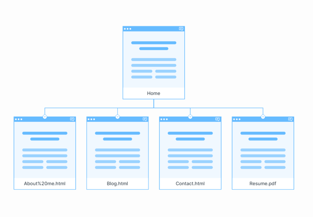
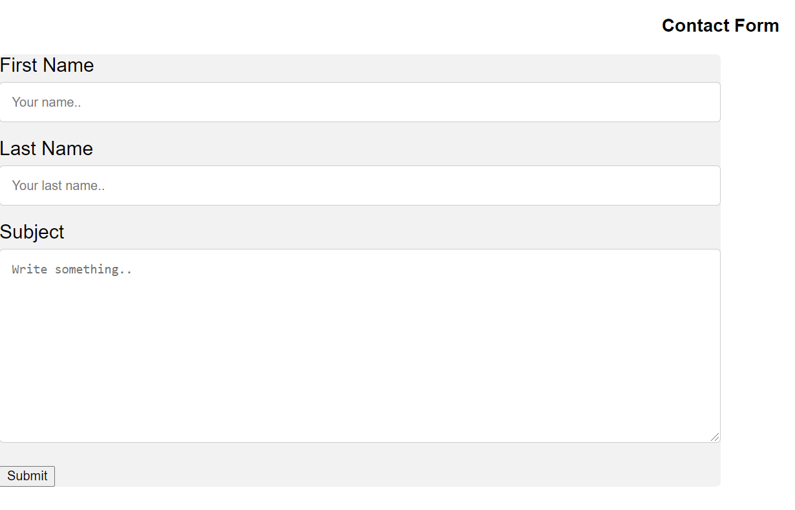
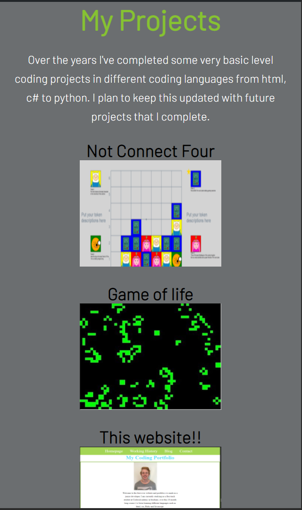

# Portfolio Website

## Link to websites

[website url](https://stoic-perlman-4066d9.netlify.app/)
[Github Repo](https://github.com/jkirky82/portfolio)

## Purpose

The purpose of this website is to create a portfolio that can be used for employers to look at my website makeing abilites.
This website won't just be made and then forget about it, it will be a website that will be kept updated so it will be a full fletched webstie that employers will use.

## Features

The website links all the pages together with a top nav bar. The current page will be highlighted on the nav bar.
Everypage has a footer that has my contact details and a link to the contact me page.
A resume button is added on the home page that will take you to my resume when clicked.

## Sitemap

## Screenshots

## Target Audience

The target audiances is employers who are looking for a developer.

## Tech Stack

The website is codded in HTML and styled with CSS, all files were stored and updated on a Github repositorie the website was deployed with Netif through my Github repositorie.
